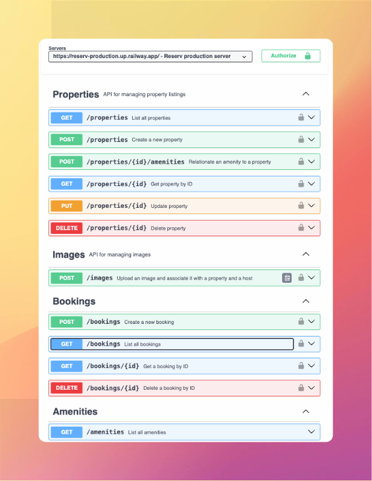

# reserv

All important commands can be found in the Makefile. Just type `make help`

# Lint and Test

- `make lint`
- `make test` (unit tests) or `make test testcase=<test_name>` (specific test)

# Integration tests

TODO(@perebaj): Integrate the integration tests with the CI pipeline.

To run the integration tests, just type `make integration-test` or `make integration-test testcase=<test_name>` (specific test), and all important containers will be started, and your tests will be executed.

Warning: `make docker-stop` is required to stop the containers after the tests are finished.

## Environment variables

- `POSTGRES_URL`: The URL for the Postgres database.
- `PORT`: The port of the API server.
- `LOG_LEVEL`: The level of the logs.
- `LOG_FORMAT`: The format of the logs.
- `CLOUDFLARE_API_KEY`: The API key for the Cloudflare API.
- `CLOUDFLARE_ACCOUNT_ID`: The account ID for the Cloudflare API.
- `CLERK_API_KEY`: The API key for the Clerk API.

# Tools

- CloudFlare Images: https://developers.cloudflare.com/images/
- Clerk for authentication: https://clerk.com/docs/
- Railway for deployment: https://railway.app/
- Postgres: https://www.postgresql.org/
- DSN: https://namecheap.com
- Frontend: [Vercel](https://vercel.com) | [V0](https://v0.dev)
- Google OAuth 2.0 API to get third party authentication on frontend
- Frontend Repository: https://github.com/perebaj/reserv-front
# Deployment

- Merge on staging branch = deploy to staging environment
- Merge on main branch = deploy to production environment

# URLs

- Backend API Staging: https://reserv-staging.up.railway.app/
- Backend API Production: https://reserv.up.railway.app/
- Frontend Production: https://www.reserva.my or https://reserv-front-orpin.vercel.app/
- Frontend Staging: Generate based on the branch name

# OpenAPI Documentation

`handler/docs/swagger.yaml`

# Demo

Youtube Link: https://youtu.be/2EygNvqWu-w

# How I use AI in the development process

- Based on the requirements, I asked for Claude to generate all endpoints necessary to deal with the use case.
- With the endpoints, was easy to generate the database schema that fit perfectly.
- Now, I dumped this docs on Vecerl-V0, and said that I would like an AirBnb clone using the above definitions.
- With that was easy to visualize the project, and to start coding.

In backend, I mostly used GitHub Copilot, because I'm more familiar with Golang.

In frontend, I used Cursor, because I'm not to good with React.
